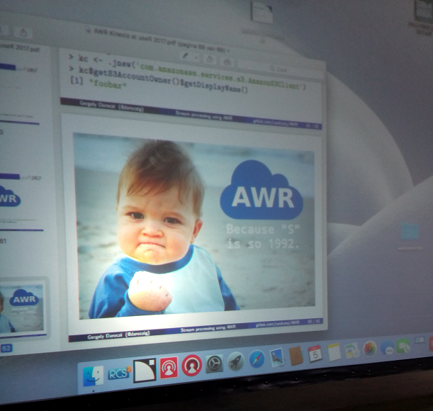
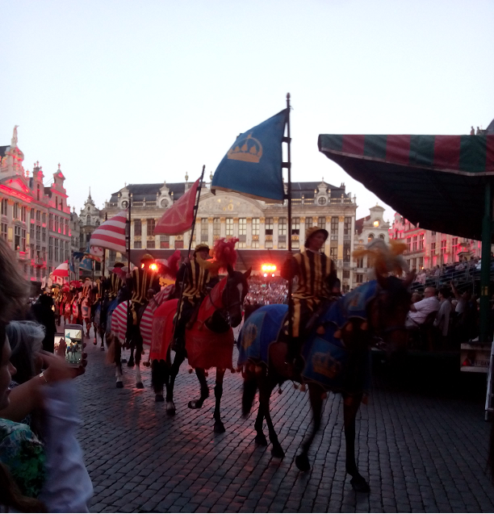

```{r setup, include=FALSE}
knitr::opts_chunk$set(echo = TRUE)
```

Day 2 is a wrap and it was an absolute success! It was hard to choose which talks to attend as there were so many. Because Day 3 looks like it's going to be equally as great we thought we'd post a short recap of just Day 2 now. Our friends from eoda posted their recap of Day 1 on their [blog](https://blog.eoda.de/2017/07/05/die-highlights-der-user-2017-der-tutorial-tuesday/) (in German but don't let that stop you). And if you've missed the talks, fear not, the [livestreams](https://user2017.brussels/livestream) will be made available after the conference. 

### Morning
It was inspiring to hear David Smith's opening talk about how R has overcome some of the past hurdles (popularity comprehensiveness, acceptability, scalability and production-readiness). You can already find his slides on the [Revolutions blog](http://blog.revolutionanalytics.com/2017/07/how-perceptions-of-r-have-changed.html). David was quickly followed by the keynote speaker Yves Rosseel. We have never seen Structured Equation Modeling explained so well. Yves is also the creator of the [lavaan](https://cran.r-project.org/web/packages/lavaan/index.html) package and the main takeaway there was that it is easy to create a package but very hard to maintain one.

There were a number of interesting talks that followed the keynote but the one that attracted the most people was the talk by Olga Mierzwa-Sulima on how Appsilon built its Shiny apps to cope with a large userbase. Their solution is very useful in a time when more and more Shiny apps are moving towards production. Coincidently Olga will also be giving the same talk at EARL London in September. Another talk that sparked a lot of attention on twitter was by Thomas Levine. If you've ever wondered what a graph sounds like check out this [tweet](https://twitter.com/drob/status/882534378471124996). At the same time as Thomas' talk, Anthony Udwin was giving a talk about outliers and how to detect them. The best part of his talk came at the end where he emphasized that just like everyone else he presented his results using the most convenient dataset, the message being that you shouldn't believe what you see and apply any new method on your own data first. Finally, the  talk that stood out just before lunch was from Mark Padgham on using the [osmdata](https://cran.r-project.org/web/packages/osmdata/index.html). The package provides access to data from OpenStreetMap which isn't only more comprehensive than data from Google Maps but also allows you to create more beautiful visualisations.

### Afternoon

For us the most interesting talks in the afternoon were the R Community talks. But before we discuss those we want to give a shoutout to Gergely Daroczi's talk on connecting R to Amazon Kinesis for stream processing. This slide says it all:


The first R Community talk by Hannah Frick and Alice Daish was about R Ladies Global and their progress towards achieving their mission: promoting gender diversity in the R community via meetups and mentorship. Their progress is truly impressive (20+ countries, 6000+ members) and it's great to see that it's making a real impact in the wider community. 

The R Ladies Global organisation is one of the initiatives that is supported by the R Consortium. In their talk, Joseph Rickert and David Smith described what other projects are currently supported by the consortium and how to get involved in these and future projects. Mango Solutions is proud to be a Silver Member of the R Consortium.

During the community talks we quickly jumped into Grace Meyer's talk on Shiny prototypes and how they can get out of control. Based on the lessons learnt from her experience with one of Mango's client, Grace explained how you can still do Shiny prototyping and development but at the same time minimise risk by applying production best practices. If you missed the talk, Grace will be also presenting at EARL London in September.

For us the day ended on a high. First there was the full house for David Robinson's talk on the landscape of R users on Stack Overflow. David's visualisations were very compelling, from the network analysis of dependent packages to the correlation between a country's GDP and its usage of R. Check out [Stack Overflow Trends](https://insights.stackoverflow.com/trends) to get a taste of what the talk was about. Second there was Mine Cetinkaya-Rundel's talk about teaching data science to beginners. Mango give a lot of training to new users of R so many of Mine's recommendations (keep setup time small, teach tidyverse, use Rmarkdown) resonated with us. You can find more information on Mine's [slides](https://github.com/mine-cetinkaya-rundel/2017-07-05-teach-ds-to-new-user). 

### AOB

* If you're going to put a toy monkey in a goody bag make sure it comes with instructions. Luckily word got around and no monkeys were screeching on Day 2.
* Poissontris by Open Analytics is the geekiest game we've ever seen at a conference.




